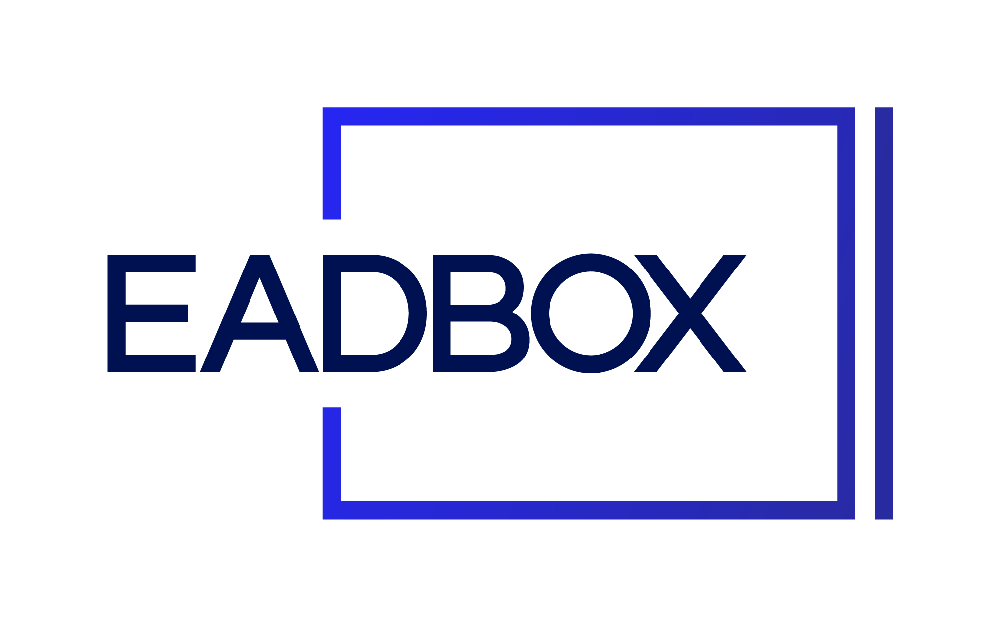
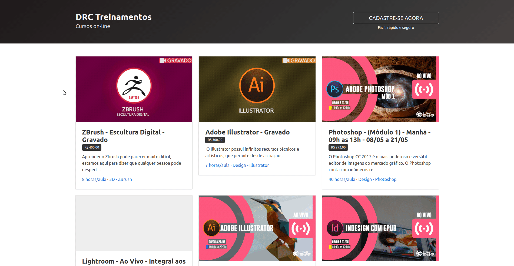

# EADBOX Course

EADBOX Course é um projeto de landing-page de cursos desenvolvido como desafio para o processo seletivo da EADBOX

> **Proposta**
> Implementar uma listagem com os cursos cadastrados na plataforma consumindo a API Eadbox utilizando Angular 2

## Desenvolvimento

### Ambiente

O aplicativo pode ser acessado através do GitHub Pages, [clicando aqui](https://lhcgoncalves.github.io/eadbox-course).

### Back-end

O EADBOX Course consome a API oficial da EADBOX¹ para o usuário definido no arquivo `src/environments/environment.ts`² em localhost ou `src/environments/environment.prod.ts` em produção.

Em desenvolvimento, é possível utilizar o `json-server`, rodando o comando `npm run json-server`, que consome o arquivo `db.json`

### Front-end

O sistema utiliza o Angular 2 como framework front-end e Bulma como framework CSS. O build faz uso do Webpack para limpeza e minificação na branch `gh-pages`.

## Como instalar localmente

Primeiro, clone o repositório e acesse a pasta raíz do projeto.

Depois, instale as dependências através do NPM:

    npm install

Inicie o servidor built-in através do comando:

    npm run start

Está lá :)

### Observações

_¹Como a API oficial possui proteção de CORS e o desafio inclui lidar com essa situação, foi necessário utilizar um proxy confiável e seguro para prover a interação sem precisar mexer nas configurações do servidor. Cogitou-se criar um servidor somente para tal finalidade (Heroku), mas como o projeto é restrito ao front-end, utilizar uma solução **segura** e confiável pareceu bastante eficaz._

_²O acesso a API com o usuário de teste que utilizei foi expirado. Localizei uma empresa que utiliza as soluções da EADBOX: a DRC Treinamentos. Por isso, utilizei a API da mesma no projeto, uma vez que já possui bastante conteúdo cadastrado_